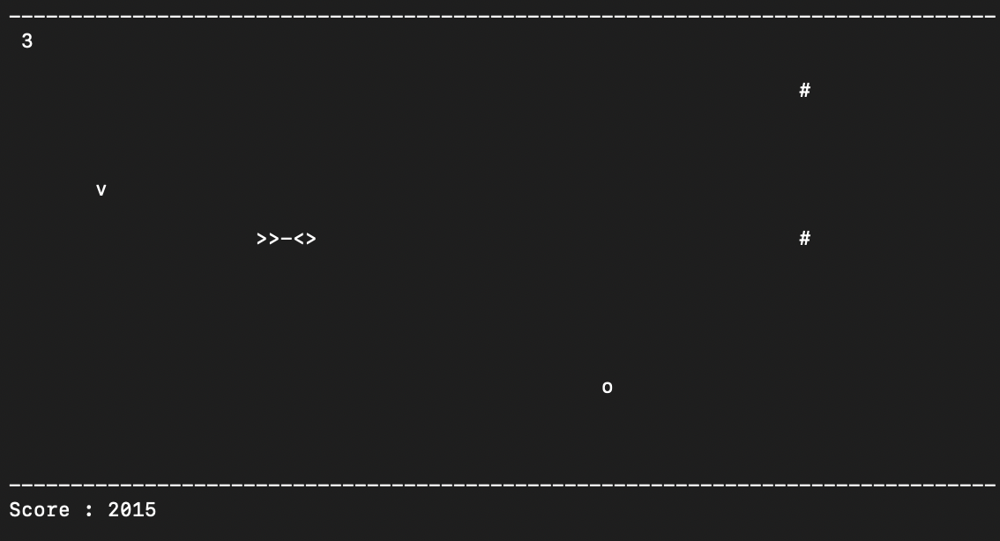

# Rocket Game

Rocket Meteors is a terminal-based game written in C++ using the ncurses library. The game involves controlling a rocket to avoid meteors and collect power-ups while aiming for a high score. The game has three levels of difficulty that increase as your score gets higher.

## Table of Contents
- [Features](#features)
- [Installation](#installation)
- [How to Play](#how-to-play)
- [Contributing](#contributing)
- [License](#license)

## Features

- Control the rocket to avoid meteors.
- Collect power-ups to increase your score.
- Different levels of difficulty.
- Leaderboard to track high scores.
## Installation

### Clone the Repository

```sh
git clone https://github.com/devansh1401/Rocket_Meteors.git
```
#### Compile the Game
Navigate to the project directory:
```sh
cd Rocket_Meteors
```
``` sh
cd Game/src
```
Compile the game using the following command:
``` sh
g++ -o RocketMeteor RocketMeteor.cpp -lncurses
```
#### Run the Game
After compiling, run the game:
``` sh
./RocketMeteor
```

## How To Play!
1. Use the 'W' and 'S' keys to move the rocket up and down, respectively.
2. Avoid colliding with the meteors, as they will end the game.
3. Collect power-ups (symbol: 'o') to increase your score.
4. Press the 'F' key to fire the rocket's boosters (available in level 3) to clear meteors in your path.
5. Reach higher scores to progress through different levels with increased difficulty.

## Some COOL🚀🚀 Screenshots!


      #### This is Level 3 #####



## Contributing
Contributions are welcome! If you find a bug or have an idea for an improvement, feel free to open an issue or submit a pull request.

## License
This project is licensed under the MIT License.

