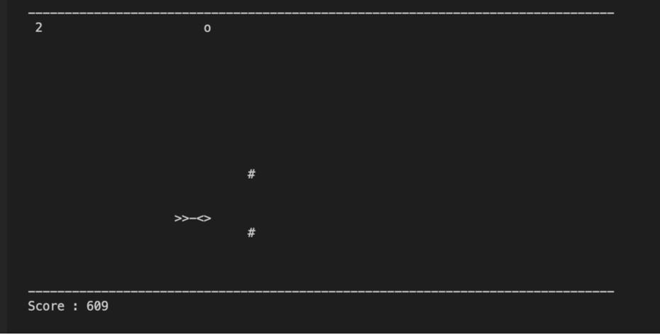

# Rocket Meteors Game

Rocket Meteors is a simple terminal-based game written in C++ using the ncurses library. The game involves controlling a rocket to avoid meteors and collect power-ups while aiming for a high score. The game has three levels of difficulty that increase as your score gets higher.

## How to Play

1. Use the 'W' and 'S' keys to move the rocket up and down, respectively.
2. Avoid colliding with the meteors, as they will end the game.
3. Collect power-ups (symbol: 'o') to increase your score.
4. Press the 'F' key to fire the rocket's boosters (available in level 3) to clear meteors in your path.
5. Reach higher scores to progress through different levels with increased difficulty.

## Getting Started

1. Clone the repository to your local machine using the following command:
git clone <repository_url>
2. Compile the game using a C++ compiler and the ncurses library.
3. Run the compiled executable to start playing the game.
4. Use the controls mentioned above to navigate and play.

## Files and Classes

- `player.h` and `player.cpp`: Defines and implements the `Player` class to manage player information.
- `rocket.h` and `rocket.cpp`: Defines and implements the `Rocket` class to control the rocket's movement.
- `meteor.h` and `meteor.cpp`: Defines and implements the `Meteor` class to handle meteor movement.
- `drop.h` and `drop.cpp`: Defines and implements the `Drop` class to manage drops in level 3.
- `powerups.h` and `powerups.cpp`: Defines and implements the `Powerups` class for power-up handling.
- `game.h` and `game.cpp`: Defines and implements the `Game` class to manage the game logic.

## Leaderboard

The game maintains a leaderboard of the top players. Your name and score will be added to the leaderboard after each game session.

## License

This project is licensed under the [MIT License](LICENSE).

Feel free to contribute, modify, and distribute the game as per the license terms.

Enjoy playing Rocket Meteors!
